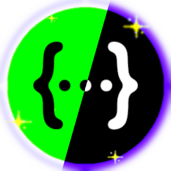

<div align="center">

<p>

</p>

# SwaggerUI.Themes

<p>
    <a href="https://github.com/teociaps/SwaggerUI.Themes/actions/workflows/build.yml">
        
    </a>
    <a href="https://github.com/teociaps/SwaggerUI.Themes/actions/workflows/test.yml">
        
    </a>
</p>

### Give your ASP.NET Core API documentation the look it deserves!

**Switch themes at runtime** &nbsp;•&nbsp; **Unlock new capabilities** &nbsp;•&nbsp; **Create and choose your custom style**
<br>
_**...and more!**_

**[Get Started](https://github.com/teociaps/SwaggerUI.Themes/wiki/Getting-Started)** • **[View Built-in Themes](https://github.com/teociaps/SwaggerUI.Themes/wiki/Predefined-Themes)** • **[Full Documentation](https://github.com/teociaps/SwaggerUI.Themes/wiki)**


_Note: GIF framerate is limited. Actual transitions are buttery smooth!_

---

| Package | Purpose | NuGet |
|---------|---------|-------|
| **AspNetCore.SwaggerUI.Themes** | For [Swashbuckle.AspNetCore][swashbuckle-link] | [![swashbuckle-nuget]][swashbuckle-nuget-link] |
| **NSwag.AspNetCore.Themes** | For [NSwag.AspNetCore][nswag-link] | [![nswag-nuget]][nswag-nuget-link] |

---

</div>

> [!WARNING]
> **Version 3.0.0 Breaking Changes**
>
> Upgrading from v2.0.0? Please review the **[Migration Guide](https://github.com/teociaps/SwaggerUI.Themes/wiki/Migration-v3)** for important API changes.


## 🚀 Quick Start

```bash
# Install package
dotnet add package AspNetCore.SwaggerUI.Themes
# or
dotnet add package NSwag.AspNetCore.Themes
```

```csharp
// Apply a theme - that's it!
app.UseSwaggerUI(Theme.Dark);      // Swashbuckle
// or
app.UseSwaggerUi(Theme.Dark);      // NSwag

// Enable runtime theme switcher!
app.UseSwaggerUI(Theme.Dark, c => c.EnableThemeSwitcher());
```

## ✨ Features

- 🔥 **[Theme Switcher](https://github.com/teociaps/SwaggerUI.Themes/wiki/Feature-Theme-Switcher)** - Switch built-in and custom themes dynamically without page reload

- **[Built-in Themes](https://github.com/teociaps/SwaggerUI.Themes/wiki/Predefined-Themes)** - Choose from predefined themes ready to use

- **[Custom Themes](https://github.com/teociaps/SwaggerUI.Themes/wiki/Custom-Themes)** - Build your own themes with full control, or create standalone themes with zero dependencies

- **[Advanced Features](https://github.com/teociaps/SwaggerUI.Themes/wiki/Advanced-Options)** - Enhance your documentation with powerful UI capabilities

- _...discover more in the [Wiki](https://github.com/teociaps/SwaggerUI.Themes/wiki/Features)!_

## 📚 Basic Usage Examples

### Swashbuckle

```csharp
using AspNetCore.Swagger.Themes;

...

// Simple theme
app.UseSwaggerUI(Theme.Dark);

// With runtime theme switcher
app.UseSwaggerUI(Theme.Dark, c =>
{
    c.EnableThemeSwitcher(); // Auto-discovers all custom themes!
});

// All advanced features
app.UseSwaggerUI(Theme.Dark, c =>
{
    c.EnableAllAdvancedOptions();
});

...
```

### NSwag

```csharp
using AspNetCore.Swagger.Themes;

...

// Simple theme
app.UseSwaggerUi(Theme.Dark);

// With runtime theme switcher
app.UseSwaggerUi(Theme.Dark, c =>
{
    c.EnableThemeSwitcher(); // Auto-discovers all custom themes!
});

// All advanced features
app.UseSwaggerUi(Theme.Dark, c =>
{
    c.EnableAllAdvancedOptions();
});

...
```

### 💡 Build your own Custom Theme

```csharp
// Organize themes in folders
// SwaggerThemes/Brands/mybrand.css

public class MyBrandTheme : Theme
{
    protected MyBrandTheme(string fileName) : base(fileName) { }
    public static MyBrandTheme Custom => new("mybrand.css");
    //... and others!
}

// Usage
app.UseSwaggerUI(MyBrandTheme.Custom, c =>
{
    c.EnableThemeSwitcher(); // Works with custom themes too!
});
```

_Learn advanced usages in the [Wiki](https://github.com/teociaps/SwaggerUI.Themes/wiki)!_

## 🤝 Contributing

Contributions are welcome! See the [Contributing Guide](CONTRIBUTING.md) for details.

## 📜 License

MIT Licensed - see [LICENSE](LICENSE) for details.

---

<div align="center">

**Made with ❤️ by [@teociaps](https://github.com/teociaps)**

</div>

<!-- Links -->
[swashbuckle-nuget]: https://img.shields.io/nuget/v/AspNetCore.SwaggerUI.Themes?logo=nuget&label=Version&color=blue
[swashbuckle-nuget-link]: https://www.nuget.org/packages/AspNetCore.SwaggerUI.Themes/
[nswag-nuget]: https://img.shields.io/nuget/v/NSwag.AspNetCore.Themes?logo=nuget&label=Version&color=blue
[nswag-nuget-link]: https://www.nuget.org/packages/NSwag.AspNetCore.Themes/
[swashbuckle-link]: https://github.com/domaindrivendev/Swashbuckle.AspNetCore
[nswag-link]: https://github.com/RicoSuter/NSwag